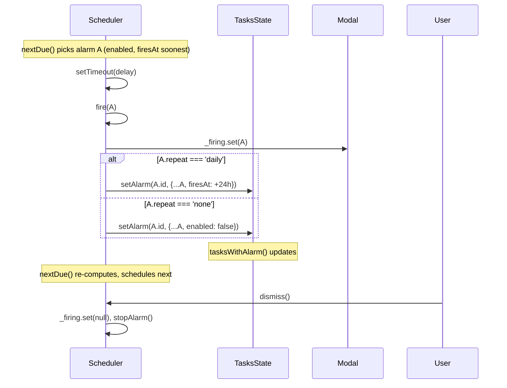

# Design — Alarm Enabled Toggle + Repeat Mode

## Overview

`AlarmSpec` gains two fields: `enabled: boolean` and `repeat: 'none' | 'daily'`. The scheduler reads from those fields instead of relying on the in-memory `_firedKeys` set; the firing handler writes them back via `TasksState.setAlarm`. The picker exposes both controls. The badge and status strip respect them.

## Architecture

```mermaid
flowchart LR
  subgraph DataAccess
    AT[alarms.types.ts]
    AS[AlarmsScheduler]
    TS[TasksState]
  end
  subgraph UI
    AP[AlarmPickerComponent]
    AB[AlarmBadgeComponent]
    AFM[AlarmFiringModalComponent]
    SS[StatusStripComponent]
  end
  AT --> AS
  AT --> AP
  AT --> AB
  AT --> SS
  AS -->|setAlarm(group, task, updated)| TS
  AP -->|alarmChange| Workspace[WorkspaceState.setTaskAlarm]
  Workspace --> TS
  SS -->|nextAlarm filtered by enabled| TS
```

## Data model

### `alarms.types.ts`

```ts
export type AlarmRepeat = 'none' | 'daily';

export interface AlarmSpec {
  firesAt: string;
  soundId: string | null;
  enabled: boolean;
  repeat: AlarmRepeat;
}
```

### Migration: legacy alarms (no `enabled` / `repeat` fields)

The persisted task rows reference `AlarmSpec` directly (see `tasks.types.ts`). Existing IndexedDB rows may have alarms that lack `enabled` and `repeat`. We normalize at the read boundary:

```ts
// alarms.types.ts (new helper)
export const normalizeAlarm = (raw: unknown): AlarmSpec | null => {
  if (!raw || typeof raw !== 'object') return null;
  const r = raw as Partial<AlarmSpec>;
  if (typeof r.firesAt !== 'string') return null;
  return {
    firesAt: r.firesAt,
    soundId: r.soundId ?? null,
    enabled: r.enabled ?? true,
    repeat: r.repeat ?? 'none',
  };
};
```

Call site: `tasks.repository.ts` (when materializing `TaskRow` from IndexedDB) and `tasks.state.ts`'s legacy-import path, wherever a row is hydrated. Migration is in-memory only — no schema bump needed because IndexedDB stores object blobs, and `normalizeAlarm` is idempotent.

The next `setAlarm` write persists the normalized shape, so the upgrade is gradual and self-healing.

## AlarmsScheduler changes

### Remove `_firedKeys`

```diff
- private readonly _firedKeys = signal<Set<string>>(new Set());
```

Replaced by two rules baked into `fire(...)`:

- `repeat === 'daily'` → write back a new `AlarmSpec` whose `firesAt` is the previous `firesAt + 24h`. The advanced `firesAt` is now in the future (or maybe still in the past for a long-missed alarm; the scheduling effect re-computes `nextDue` and either schedules with delay 0 or with the correct future delay — see "Missed alarms" below).
- `repeat === 'none'` → write back the same `AlarmSpec` with `enabled = false`.

In both cases the write goes through `TasksState.setAlarm(groupId, taskId, updated)`.

### `nextDue` filter

```ts
private readonly nextDue = computed<{ task: Task; groupId: string; at: number } | null>(() => {
  let best: { task: Task; groupId: string; at: number } | null = null;
  for (const entry of this.tasksState.tasksWithAlarm()) {
    const alarm = entry.task.alarm;
    if (!alarm || !alarm.enabled) continue;       // ← new filter
    const at = Date.parse(alarm.firesAt);
    if (Number.isNaN(at)) continue;
    if (!best || at < best.at) best = { ...entry, at };
  }
  return best;
});
```

Note the `key` field is gone — no `firedKeys` lookup, so no key needed.

### Missed alarms

When the app boots with a stale alarm whose `firesAt` is already in the past, the scheduling effect computes `delay = Math.max(0, at - now) = 0`. `setTimeout(handler, 0)` fires on the next macrotask. The handler:

- For daily: advances `firesAt + 24h`. If the new `firesAt` is **still** in the past (e.g., daily alarm missed for a week), the scheduling effect re-computes `nextDue`, sees the new `firesAt` is still past, schedules another delay-0 fire. This produces a tight loop that catches up day-by-day until `firesAt` is in the future. Each catch-up fires the modal — undesirable.

  **Mitigation**: in the daily branch, advance by 24h *until* the new `firesAt` is in the future, in a single `setAlarm` call. The user sees the modal once. Implementation:

  ```ts
  let next = Date.parse(alarm.firesAt);
  do { next += 86_400_000; } while (next <= Date.now());
  const updated = { ...alarm, firesAt: new Date(next).toISOString() };
  ```

- For one-shot: `enabled = false`. The user sees the modal once.

### Fire handler

```ts
private fire(entry: { task: Task; groupId: string }): void {
  const alarm = entry.task.alarm;
  if (!alarm) return;
  this._firing.set({ task: entry.task, groupId: entry.groupId });
  void this.playForAlarm(alarm.soundId);

  if (alarm.repeat === 'daily') {
    let nextMs = Date.parse(alarm.firesAt);
    do { nextMs += 86_400_000; } while (nextMs <= Date.now());
    this.tasksState.setAlarm(entry.groupId, entry.task.id, {
      ...alarm,
      firesAt: new Date(nextMs).toISOString(),
    });
  } else {
    this.tasksState.setAlarm(entry.groupId, entry.task.id, {
      ...alarm,
      enabled: false,
    });
  }
}
```

The scheduling effect re-runs because `tasksState.tasksWithAlarm()` is reactive — `nextDue` re-computes naturally.

### Sequence diagram



## Picker UI changes

### Layout sketch

```
┌── Set alarm ────────── [bell-off (clear)] ──┐
│                                              │
│ [Time spinner]                               │
│                                              │
│ Fires │ 9:00       │ Tomorrow                │
│                                              │
│ ┌─ Enabled ──────────────────────── [ ON ]   │
│ └───────────────────────────────────────────│
│                                              │
│ ┌─ Repeat ──────────────────────────────────┐
│ │  ( ) One-shot   ( ) Daily                 │
│ └───────────────────────────────────────────┘
│                                              │
│ Sound │ [dropdown]                           │
│                                              │
│ Manage sounds →                              │
│                                              │
│                          [ Done ]            │
└──────────────────────────────────────────────┘
```

### Component changes

- New computed: `currentEnabled = computed(() => this.alarm()?.enabled ?? true)`.
- New computed: `currentRepeat = computed<AlarmRepeat>(() => this.alarm()?.repeat ?? 'none')`.
- New handlers:
  - `onEnabledChange(value: boolean)` — emits alarmChange with `{ ...current, enabled: value, firesAt: value && pastFiresAt ? reArmedFiresAt : current.firesAt }`.
  - `onRepeatChange(value: AlarmRepeat)` — emits alarmChange with `{ ...current, repeat: value }`.
- The existing `onTimeChange` and `onSoundChange` paths need to preserve `enabled` and `repeat` when emitting.
- The picker is opened in "create" mode when `alarm()` is `null`. In that case `onTimeChange` builds a new `AlarmSpec` — defaults `enabled = true`, `repeat = 'none'`.

### Re-arming logic for the enabled toggle

```ts
protected onEnabledChange(value: boolean): void {
  const current = this.alarm();
  if (!current) return;            // no alarm yet — toggle is hidden
  if (value) {
    // turning ON: if firesAt is in the past, advance to next occurrence
    const fired = Date.parse(current.firesAt);
    let firesAt = current.firesAt;
    if (!Number.isNaN(fired) && fired <= Date.now()) {
      const t = parseHourMinute(current.firesAt);
      if (t) firesAt = nextOccurrenceIso(t.hour, t.minute);
    }
    this.alarmChange.emit({ ...current, enabled: true, firesAt });
  } else {
    this.alarmChange.emit({ ...current, enabled: false });
  }
}
```

The `parseHourMinute` and `nextOccurrenceIso` helpers already exist in `alarm-format.ts`.

## Badge UI changes

`AlarmBadgeComponent` currently has one style. Add a disabled-state class:

```ts
readonly alarm = input.required<AlarmSpec>();

protected readonly isDisabled = computed(() => this.alarm().enabled === false);
protected readonly badgeClass = computed(() =>
  cn(
    'inline-flex items-center gap-1 rounded-md border-2 border-border px-1.5 h-6 tracking-tight',
    this.isDisabled()
      ? 'bg-secondary-background/50 text-muted-foreground opacity-60'
      : 'bg-secondary-background text-foreground font-semibold',
  ),
);
```

The icon switches to `bell-off` when disabled.

## Status-strip change

`WorkspaceState.nextAlarm` becomes:

```ts
readonly nextAlarm = computed<{ task: Task; groupId: string; at: number } | null>(() => {
  let best: { task: Task; groupId: string; at: number } | null = null;
  for (const entry of this.tasksState.tasksWithAlarm()) {
    const alarm = entry.task.alarm;
    if (!alarm || !alarm.enabled) continue;     // ← new filter
    const at = Date.parse(alarm.firesAt);
    if (!Number.isNaN(at) && (!best || at < best.at)) {
      best = { task: entry.task, groupId: entry.groupId, at };
    }
  }
  return best;
});
```

(StatusStripComponent reads `workspace.nextAlarm()` — no changes there.)

## Persistence

No schema bump. The IndexedDB store holds object blobs. Adding two fields is backwards-compatible:

- **Read path**: `normalizeAlarm` in `tasks.repository.ts` (or wherever rows are converted into `TaskRow`) injects defaults if fields are missing.
- **Write path**: `TasksState.setAlarm` writes whatever `AlarmSpec` is passed. The picker and scheduler both pass fully-populated specs after the migration helper has run.

## Edge cases

1. **Daily alarm whose user toggled enabled off, then on after several days** — `onEnabledChange(true)`'s re-arm logic recomputes `firesAt` to next occurrence (today or tomorrow at the same hour:minute). The user's "daily" intent is preserved.
2. **One-shot alarm fires while modal already open** — current scheduler dedups via `_firing` being non-null (no, actually it doesn't — it just overwrites). Out of scope to fix, but worth noting; the fire path is the same as today.
3. **DST**: `+ 86_400_000` is a calendar-blind 24h. On spring-forward, the alarm shifts an hour later in local time; on fall-back, an hour earlier. Documented in requirements as out of scope.
4. **User turns off enabled while the firing modal is up** — the modal stays visible (it reads `_firing`, not the alarm's enabled state). User can dismiss as normal. Scheduler's next computation respects the new state.
5. **User changes repeat while the alarm is firing** — `_firing` is already non-null, so the modal stays. The next fire (24h later for daily, or never for one-shot) uses the new repeat value because `fire()` reads the alarm from `tasksState` again. Actually wait — in the current `fire(entry)` signature, `entry.task.alarm` is the snapshot from `nextDue`. If the user mutates it between scheduling and firing, the handler uses the snapshot. Fix: re-read the alarm at fire time from `tasksState.findTask(taskId)`. Cheap.

```ts
private fire(entry: { task: Task; groupId: string }): void {
  const found = this.tasksState.findTask(entry.task.id);
  const alarm = found?.task.alarm;
  if (!alarm) return;     // user removed it before fire
  ...
}
```

## Testing approach

Unit (`alarms.scheduler.spec.ts`, new — currently the scheduler has no spec):

- enabled = false alarm is not scheduled.
- enabled = true alarm fires at the right time.
- daily alarm fires → `setAlarm` called with `firesAt + 24h`.
- daily alarm whose `firesAt` is 3 days in the past → `setAlarm` called once with `firesAt + 3×24h` (next future day).
- one-shot alarm fires → `setAlarm` called with `enabled: false`.
- dismiss() clears `_firing` only.

Component (no existing component specs — match codebase convention and rely on data-access tests).

Migration (`tasks.repository.spec.ts` or a new `normalize-alarm.spec.ts`):

- Legacy `{ firesAt, soundId }` → normalized adds `enabled: true`, `repeat: 'none'`.
- `null` / non-object inputs → returns null.

`WorkspaceState.nextAlarm` test addition:

- Two enabled alarms → returns the soonest.
- One enabled + one disabled → returns the enabled, even if disabled is sooner.

## What this design deliberately does not do

- No weekly / cron-style recurrence.
- No DST-stable hour preservation.
- No snooze.
- No alarm history.
- No per-weekday selection.
