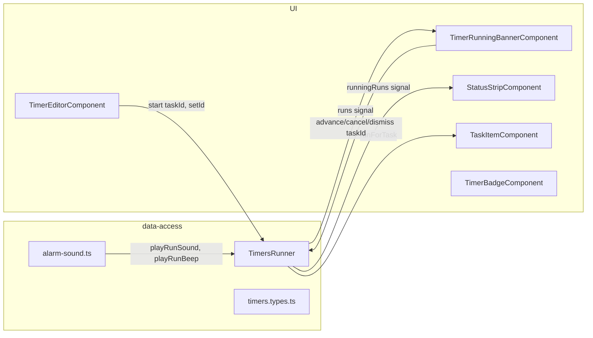
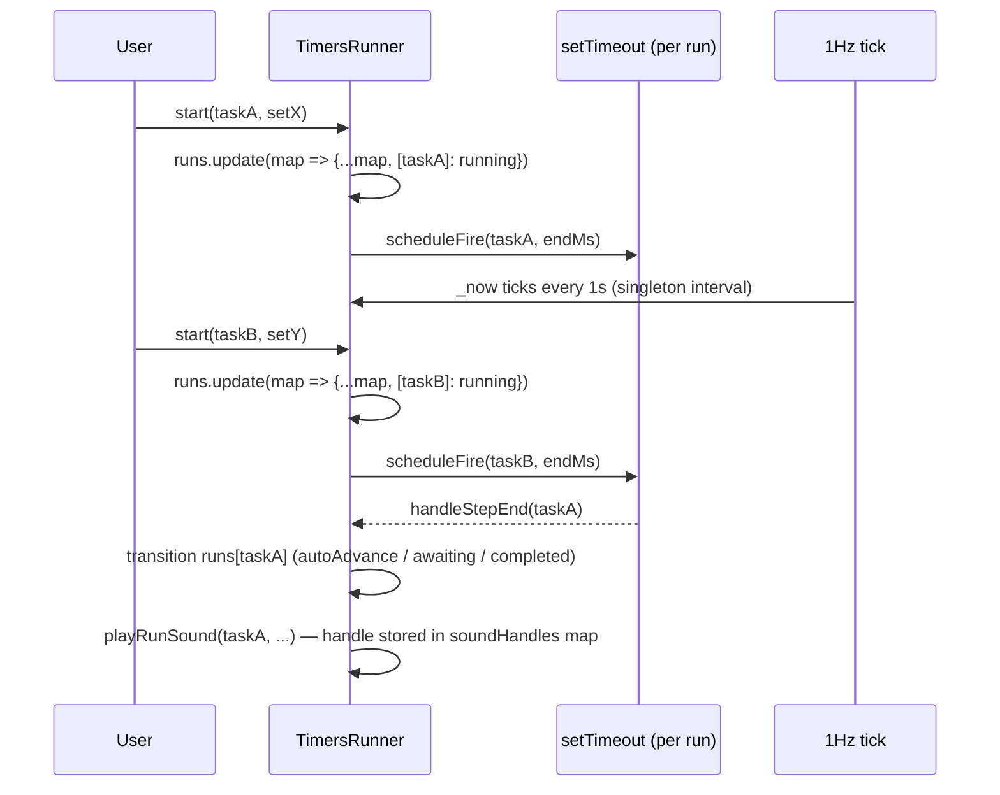
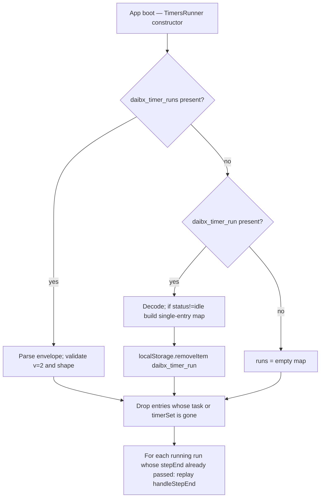

# Design — Multiple Concurrent Timers

## Overview

`TimersRunner` becomes a multi-run coordinator. Instead of a single `TimerRun` signal, it owns a map of `ActiveRun` keyed by `taskId`. Per-task identity is the natural primary key — it matches the requirement that one task can have at most one active timer, and it makes lookups from `TaskItemComponent` trivial.

A single 1-second tick continues to drive all `remainingSeconds` computations. Each `running` run gets its own `setTimeout` for its step end. Each playing alarm sound becomes a per-run handle so multiple runs can ring at once.

The banner gains a `focusedTaskId` signal that cycles through attention-state runs.

## Architecture



## Data model

### `ActiveRun` (in `timers.types.ts`)

The `idle` variant is removed. Absence from the map is the new idle state.

```ts
export type ActiveRun =
  | {
      status: 'running';
      taskId: string;
      groupId: string;
      timerSetId: string;
      currentIndex: number;
      stepStartedAt: string;
    }
  | {
      status: 'awaitingAdvance';
      taskId: string;
      groupId: string;
      timerSetId: string;
      completedIndex: number;
      finishedAt: string;
    }
  | {
      status: 'completed';
      taskId: string;
      groupId: string;
      timerSetId: string;
      finishedAt: string;
    };

export type TimerRunsMap = Record<string, ActiveRun>;
```

The legacy `TimerRun` union remains exported as a type alias `ActiveRun | { status: 'idle' }` **only** for the duration of the migration helper. Once removed it is gone — consumers move to `ActiveRun` or `null`.

### Storage layout

- New key: `daibx_timer_runs`.
- Payload shape: a versioned envelope.
  ```ts
  { v: 2; runs: TimerRunsMap }
  ```
- Legacy key `daibx_timer_run` is read once on first boot, converted into a single-entry map, then removed. After that the legacy key is never written again.

Persistence is debounced into a microtask: an `effect()` writes once per reactive tick regardless of how many runs transitioned, satisfying NFR-4.

## TimersRunner API

```ts
@Injectable({ providedIn: 'root' })
export class TimersRunner {
  // Read
  readonly runs: Signal<TimerRunsMap>;
  readonly runningRuns: Signal<RunWithKey[]>;       // sorted by endMs ascending
  readonly attentionRuns: Signal<RunWithKey[]>;     // sorted by finishedAt ascending
  readonly focusedRun: Signal<FocusedRun | null>;   // banner's current pick

  runForTask(taskId: string): ActiveRun | null;     // pure helper, used by TaskItem
  remainingSecondsFor(taskId: string): number | null;
  currentStepFor(taskId: string): StepInfo | null;

  // Write
  start(groupId: string, taskId: string, timerSetId: string): void;
  advance(taskId: string): void;
  cancel(taskId: string): void;
  dismiss(taskId: string): void;

  // Banner navigation
  focusNext(): void;
  focusPrev(): void;
}

type RunWithKey = { taskId: string; run: ActiveRun };
type FocusedRun = { taskId: string; run: ActiveRun; index: number; total: number };
type StepInfo = { set: TimerSet; step: TimerSpec; index: number };
```

### `runningRuns` and `attentionRuns`

- `runningRuns`: filter `runs` for `status === 'running'`, attach the resolved `TimerSet`, compute `endMs = Date.parse(stepStartedAt) + step.durationMinutes * 60_000`, sort ascending by `endMs`. Used by the status-strip chip ("soonest first").
- `attentionRuns`: filter for `status === 'awaitingAdvance'` or `'completed'`, sort ascending by `finishedAt`. Used by the banner cycler.

Both are `computed` signals — they re-derive whenever `runs` changes.

### `focusedRun`

`_focusedTaskId: signal<string | null>(null)` plus a `computed` projection:

```
focusedRun = computed(() => {
  const list = attentionRuns();
  if (list.length === 0) return null;
  const id = _focusedTaskId();
  const idx = id == null ? 0 : list.findIndex(r => r.taskId === id);
  const safeIdx = idx === -1 ? 0 : idx;
  const pick = list[safeIdx];
  return { taskId: pick.taskId, run: pick.run, index: safeIdx, total: list.length };
});
```

An `effect()` keeps `_focusedTaskId` valid: when it points to a task no longer in `attentionRuns`, it snaps to the first entry's `taskId` (or `null` if the list is empty). This implements Story 3 AC 7 and the post-action focus rule (ACs 4–5).

`focusNext()` / `focusPrev()` rotate `_focusedTaskId` within the list with wrap-around.

### Per-task lookup helpers

- `runForTask(taskId)` returns `runs()[taskId] ?? null`. Consumers wrap it in their own `computed`.
- `remainingSecondsFor(taskId)` and `currentStepFor(taskId)` are convenience computeds keyed by taskId — they read `_now` and `runs()[taskId]`.

The banner and status strip don't use these — they read from `focusedRun()` and `runningRuns()` respectively. `TaskItemComponent` uses `runForTask(this.task().id)` inside its own `computed`.

## Per-run scheduling



- One singleton 1-second `setInterval` updates `_now`. Started when `runningRuns().length > 0`, stopped when it returns to zero. Implemented via an `effect()` on `runningRuns().length`.
- Per-run `setTimeout`s live in `private fireTimeouts = new Map<string, ReturnType<typeof setTimeout>>()`. The scheduling `effect()` diffs the previous and next `runningRuns` maps — clearing timeouts for keys that left or whose `stepStartedAt` changed, and scheduling new ones for keys that entered.
- Per-run sound stop handles live in `private soundHandles = new Map<string, () => void>()`. Cleared when the run is removed or transitions out of `awaitingAdvance` / `completed`.

## Banner UI changes

`timer-running-banner.component.html`:

- Visibility: `@if (focusedRun(); as f)` — banner is shown whenever a focused run exists, i.e., at least one attention-state run.
- Header: task name comes from `focusedRun().taskId` lookup.
- Status block: switches on `f.run.status` (same three cases as today: running / awaitingAdvance / completed).
- New control row (rendered only when `f.total > 1`):
  - Prev button (icon `chevron-left`) → `runner.focusPrev()`
  - "k of N" pill: `{{ f.index + 1 }} / {{ f.total }}`
  - Next button (icon `chevron-right`) → `runner.focusNext()`
- Action handlers take the focused taskId:
  - `onAdvance() → runner.advance(f.taskId)`
  - `onCancel() → runner.cancel(f.taskId)`
  - `onDone() → runner.dismiss(f.taskId)`
- Per Story 3 ACs 4–5, after `advance` / `dismiss`, the runner's focus effect snaps to the next entry naturally; the template re-renders.

> Note on `running` state appearing in the banner: today, the banner is hidden while the focused run is `running` (current `isVisible` rule). Because the banner now follows `focusedRun()` which is derived from **attention-state** runs only, that rule is preserved — `running` runs cannot become the focused one.

## Status-strip chip changes

`status-strip.component.ts` / `.html`:

- `hasActiveTimer = computed(() => runner.runningRuns().length > 0)`.
- `chipRun = computed(() => runner.runningRuns()[0] ?? null)` — soonest-to-fire.
- `timerRemaining` and `timerStepBadge` derive from `chipRun()` using `runner.remainingSecondsFor` / `runner.currentStepFor`.
- Extra count badge: `extraRunning = computed(() => Math.max(0, runner.runningRuns().length - 1))`. Template renders `+N` when `> 0`.

## Task-item indicator changes

`task-item.component.ts`:

```ts
protected readonly isTimerActive = computed(() => {
  const r = this.runner.runForTask(this.task().id);
  return r?.status === 'running' || r?.status === 'awaitingAdvance';
});
```

(Removes the global `r.taskId === this.task().id` comparison, which was the bug source: the old runner only ever held one taskId.)

## Timer-editor changes

`timer-editor.component.ts.start()`:

```ts
this.runner.start(this.groupId(), this.taskId(), set.id);
this.closed.emit();
```

No signature change at the call site — the runner's `start` method already accepts those three arguments.

## Sound module changes

Two new exports in `alarm-sound.ts`:

```ts
export const playRunSound = (blob: Blob, opts: { loop?: boolean }): { stop: () => void };
export const playRunBeep = (): { stop: () => void };
```

Each call creates its own `HTMLAudioElement` / oscillator pair and returns a `stop` closure. They do **not** call `stopAlarm()` first — that is what enables overlap.

`stopAlarm()`, `playBeep()`, and `playSoundBlob()` are kept as-is; they remain the single-slot API used by the alarms feature (which still wants "next alarm replaces previous"). Only the timers runner switches to the per-run variants.

Inside the runner:

```ts
private playForRun(taskId: string, setSoundId: string | null): void {
  // resolve blob or beep, same fallback chain as before
  const handle = blob ? playRunSound(blob, { loop: true }) : playRunBeep();
  this.soundHandles.get(taskId)?.stop();
  this.soundHandles.set(taskId, handle.stop);
}

private stopSoundFor(taskId: string): void {
  this.soundHandles.get(taskId)?.stop();
  this.soundHandles.delete(taskId);
}
```

`stopSoundFor` is called whenever a run leaves `awaitingAdvance` / `completed` (advance, cancel, dismiss, or external removal).

## Persistence & migration



- `ResolveStale` runs *after* `tasksState.isLoaded()` becomes true. Same effect pattern as today, but instead of resetting the whole run, it drops only the offending entries.
- `ReplayElapsed` (Story 6 AC 4): in the scheduling effect, if a run's `endMs <= Date.now()`, fire its handler immediately instead of `setTimeout(..., delay)`. This is the same control path that handles "delay <= 0" today.

## Diffing the scheduling effect

The runner's scheduling effect needs to handle adds, removes, and changes. Sketch:

```ts
private scheduledKeys = new Map<string, string>(); // taskId -> stepStartedAt fingerprint

effect(() => {
  const desired = new Map<string, ActiveRun>();
  for (const [id, r] of Object.entries(this._runs())) {
    if (r.status === 'running') desired.set(id, r);
  }
  // remove timeouts no longer needed
  for (const [id, fp] of this.scheduledKeys) {
    const r = desired.get(id);
    if (!r || r.stepStartedAt !== fp) {
      clearTimeout(this.fireTimeouts.get(id)!);
      this.fireTimeouts.delete(id);
      this.scheduledKeys.delete(id);
    }
  }
  // add new / changed
  for (const [id, r] of desired) {
    if (this.scheduledKeys.get(id) === r.stepStartedAt) continue;
    this.scheduleFire(id, r);
    this.scheduledKeys.set(id, r.stepStartedAt);
  }
});
```

The 1Hz tick effect is independent:

```ts
effect(() => {
  const hasRunning = this.runningRuns().length > 0;
  if (hasRunning && !this.tickIntervalId) this.startTick();
  if (!hasRunning && this.tickIntervalId) this.stopTick();
});
```

## Edge cases & decisions

1. **Starting a timer on a task that already has a `completed` run** — Story 1 AC 2 says replace. The new `running` run also implicitly clears the previous run's sound (via `stopSoundFor`).
2. **`running` run whose task or timer set disappears mid-run** — the cleanup effect removes it; the scheduling-diff effect clears the `setTimeout`; the sound effect stops the sound. All three are idempotent against the same removal event.
3. **Two timers fire in the same JS tick** — both `setTimeout`s fire one after the other in the task queue. Each calls `playForRun` independently. With the new per-run sound helpers, both sounds start. Both transitions write `runs` once each; the persistence effect coalesces into one write.
4. **User cancels the focused run via the banner** — `cancel(taskId)` removes the run; the focus-validity effect snaps to the next attention run or to `null`; the banner re-renders.
5. **Reload during `awaitingAdvance`** — the run is restored as-is; no sound restarts (we don't persist sound handles). The user can still click Next to advance. This matches today's behavior (sound is lost on reload anyway because `Audio` elements aren't serializable).
6. **No global cap** — we accept that a user could start dozens of timers. The cost is one `setTimeout` plus one Audio per running run plus one map entry. Acceptable for the realistic workload (handful of timers).

## Testing approach

- **Unit (`timers.runner.spec.ts`)**:
  - Two concurrent `start` calls produce two entries in `runs`.
  - Step-end on one task transitions only that task.
  - `runningRuns` sorted by `endMs`.
  - `attentionRuns` sorted by `finishedAt`.
  - `focusedRun` snaps when its taskId leaves the attention list.
  - `focusNext` / `focusPrev` wrap correctly.
  - Cancel on one task does not affect others.
  - Reload: legacy single-run payload imports, legacy key cleared.
  - Reload: running run with elapsed end transitions immediately.
  - Task or timer-set removal drops only that entry.
- **Component (banner)**: visibility tied to `focusedRun`, prev/next visible when `total > 1`, advance/cancel/dismiss invoke runner with focused taskId.
- **Component (status strip)**: chip visible iff `runningRuns().length > 0`, `+N` badge appears when ≥ 2.
- **Component (task item)**: `isTimerActive` true only for own taskId.

Existing `timers.runner.spec.ts` is rewritten; the prior single-run tests become two-run tests by adding a second `start` call to each.

## What this design deliberately does not do

- It does not introduce a UI for multiple banners on screen at once. The cycler is the single banner shape the user picked.
- It does not change the alarms feature's single-slot sound model. Only the timers runner uses the new per-run sound helpers.
- It does not add a maximum running count. The user can start as many as they have tasks.
- It does not persist banner focus across reloads — `_focusedTaskId` resets on boot and snaps to the first attention run.
